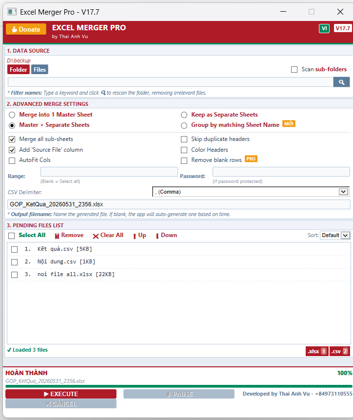
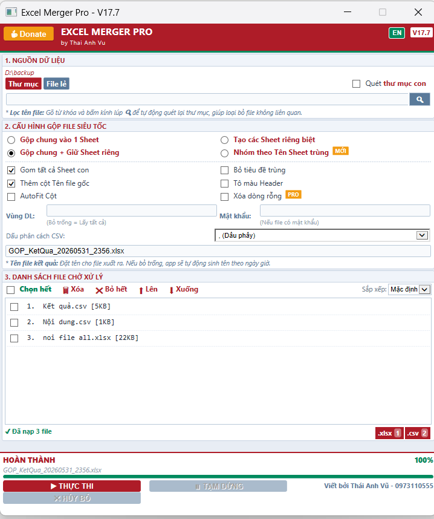

<h1 align="center">📊 Excel Merger Pro - 100% FREE</h1>

  
  
  
  

  <b>The Ultimate, Full-Featured, and 100% Free Standalone Tool for Merging Multiple Excel Files.</b> 
  Incredibly easy to use with powerful options. No installation, no Python, no libraries required. Just download and run!

---

## 🇺🇸 English (Tiếng Việt ở bên dưới)

**Excel Merger Pro** is a lightweight, blazing-fast, and **completely FREE** Windows application designed for accountants, data analysts, and office workers. It helps you merge hundreds of Excel files (`.xlsx`, `.xls`, `.csv`, `.xlsm`) into a single file in seconds, saving you hours of manual copy-pasting.

### ✨ Key Features (100% Free & Unlocked)
- **Zero Installation:** Runs natively on Windows using HTA (HTML Application). No need to install Python, Node.js, or any third-party libraries.
- **Incredibly Easy to Use:** A clean, intuitive interface. Just drag-and-drop or select your files and hit "Execute".
- **Smart Merging Modes:**
  - **Merge into 1 Master Sheet:** Appends all data from all files vertically into one single master sheet.
  - **Keep as Separate Sheets:** Keeps every file's data separated (each file becomes its own sheet in the new workbook).
  - **Master + Separate Sheets:** The ultimate All-in-One mode! It generates a Master Sheet containing ALL merged data, AND also includes the individual sheets of each file in the same workbook for easy reference.
  - **Group by matching Sheet Name:** Merges sheets with the exact same name across multiple workbooks into their respective matching sheets.
- **Advanced Options:** 
  - Automatically remove duplicate headers.
  - Append a "Source File" column to trace data origin.
  - Auto-fit columns and colorize headers for beautiful output.
  - Skip blank rows automatically.
- **Bilingual UI:** Instantly toggle between English and Vietnamese.

### 🚀 How to use
1. Download the `ExcelMergerPro_Release.hta` file from the [Releases](https://github.com/dynamic504/Excel-Merger-Pro/releases/tag/v17.7) tab.
2. Double-click the file to open the app (Requires Microsoft Excel installed on your PC).
3. Click the **Folder** button to scan a directory, or the **Files** button to select specific files.
4. Choose your merge settings and click **Execute**.

### ⚠️ Note on Antivirus (Windows Defender / Kaspersky)
Because this app is an HTA (HTML Application) that uses `ActiveX` to communicate directly with Microsoft Excel, some Antivirus software might show a warning. **This is a false positive.** The app runs completely offline and does not connect to the internet.

### ☕ Support the Developer
If this FREE tool saves you hours of manual work every month, consider buying me a coffee to support future updates!
- **PayPal:** [paypal.me/VuThaiAnh1510](https://paypal.me/VuThaiAnh1510)

---

## 🇻🇳 Tiếng Việt

**Excel Merger Pro** là công cụ **HOÀN TOÀN MIỄN PHÍ**, siêu nhẹ, siêu tốc dành cho dân văn phòng, kế toán và ngân hàng. Giúp bạn gộp hàng trăm file báo cáo Excel (`.xlsx`, `.xls`, `.csv`, `.xlsm`) thành một file duy nhất chỉ trong vài giây, đánh bay nỗi ám ảnh copy-paste thủ công.

### ✨ Tính năng Nổi bật (Miễn phí 100% & Đầy đủ chức năng)
- **Dễ sử dụng vô đối:** Giao diện trực quan, rõ ràng, có nhiều tùy chọn mạnh mẽ nhưng lại cực kỳ thân thiện với người không biết code.
- **Không Cần Cài Đặt:** Chạy trực tiếp trên nền tảng Windows. Không cần cài Python hay bất kỳ phần mềm rườm rà nào khác. Tải về click đúp là xài!
- **Nhiều Chế độ Gộp Thông minh:**
  - **Gộp chung vào 1 Sheet:** Nối dọc toàn bộ dữ liệu từ các file thành 1 Sheet dài duy nhất (phù hợp gộp báo cáo tháng/năm).
  - **Tạo các Sheet riêng biệt:** Giữ nguyên dữ liệu, mỗi file sẽ trở thành 1 Sheet riêng biệt trong file kết quả.
  - **Gộp chung + Giữ Sheet riêng:** Chế độ Tất-cả-trong-một! App sẽ tạo ra 1 Sheet Tổng Hợp (chứa toàn bộ dữ liệu đã gộp), ĐỒNG THỜI vẫn chèn thêm các Sheet lẻ của từng file gốc ở phía sau để bạn dễ dàng đối chiếu khi cần.
  - **Nhóm theo Tên Sheet trùng:** Tìm các Sheet có cùng tên ở các file khác nhau để gộp chung lại với nhau.
- **Tùy chỉnh Nâng cao:** 
  - Tự động bỏ qua dòng tiêu đề bị trùng lặp.
  - Thêm cột "Nguồn File" để dễ đối soát.
  - Tự động căn chỉnh độ rộng cột (AutoFit) và tô màu Tiêu đề.
  - Tự động xóa các dòng trống.
- **Giao diện Song ngữ:** Chuyển đổi Anh/Việt cực mượt chỉ với 1 nút bấm.

### 🚀 Hướng dẫn Sử dụng
1. Tải file `ExcelMergerPro_Release.hta` về máy.
2. Click đúp vào file để mở (Yêu cầu máy tính có cài sẵn Microsoft Excel).
3. Bấm nút **Thư mục** để chọn thư mục cần quét, hoặc nút **File lẻ** để chọn từng file.
4. Tùy chỉnh cấu hình và bấm **Thực Thi**.

### ⚠️ Lưu ý về Phần mềm Diệt Virus (Kaspersky / Defender)
Vì đây là file script dạng HTA, sử dụng mã lệnh `ActiveX` để giao tiếp trực tiếp với Microsoft Excel trên máy tính của bạn, một số trình diệt virus có thể hiện cảnh báo lạ. **Hãy yên tâm bấm Cho Phép (Allow).** App chạy hoàn toàn offline và tuyệt đối an toàn.

### ☕ Ủng hộ Tác giả (Donate)
Nếu công cụ MIỄN PHÍ này giúp bạn về sớm mỗi ngày, thoát kiếp mờ mắt làm báo cáo, hãy mời tác giả một ly cà phê nhé!
- **Ngân hàng MB Bank:** `0973110555` - Chủ TK: THAI ANH VU
- **MoMo / ZaloPay:** `0973 110 555`
- **PayPal:** [paypal.me/VuThaiAnh1510](https://paypal.me/VuThaiAnh1510)
